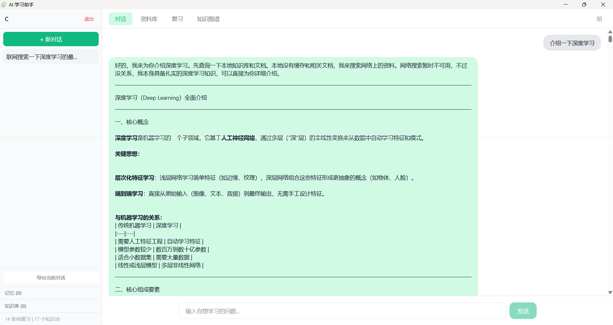
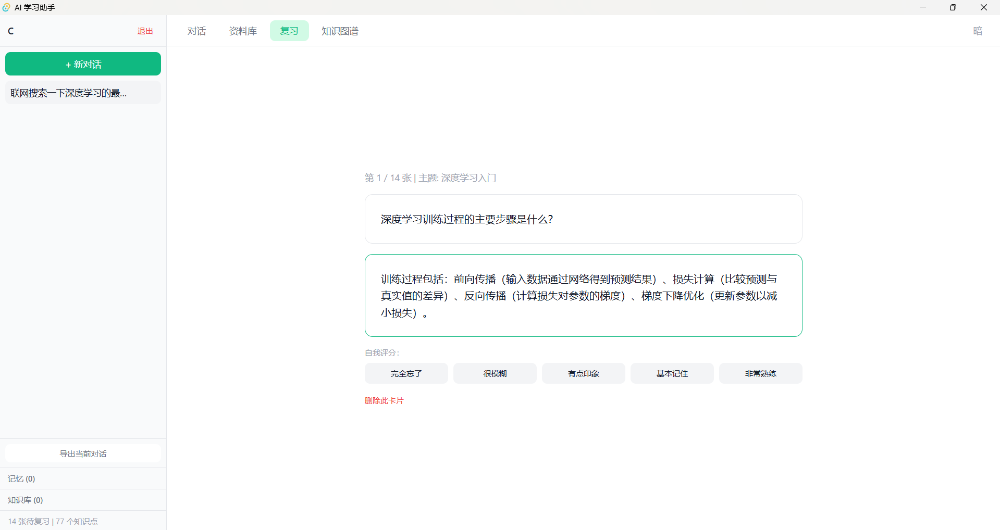

# AI 学习助手 · AI Study Assistant

[](https://python.org)
[](https://streamlit.io)
[](https://fastapi.tiangolo.com)
[](LICENSE)

> 基于 LLM Agent 的个性化学习助手 —— 对话式学习、知识管理、间隔重复复习、知识图谱可视化。

---

## 目录

- [架构](#架构)
- [功能](#功能)
- [技术栈](#技术栈)
- [快速开始](#快速开始)
- [项目结构](#项目结构)
- [API 文档](#api-文档)
- [配置](#配置)
- [截图](#截图)

---

## 架构

```
┌─────────────────────────────────────────────────────┐
│                    Streamlit UI                      │
│  ┌──────┐  ┌──────────┐  ┌──────┐  ┌────────────┐  │
│  │ 对话  │  │  资料库   │  │ 复习  │  │  知识图谱   │  │
│  └──┬───┘  └────┬─────┘  └──┬───┘  └──────┬─────┘  │
│     │            │           │              │        │
│     └────────────┴───────────┴──────────────┘        │
│                      │                               │
├──────────────────────┴──────────────────────────────┤
│                 Agent (LangChain)                     │
│  ┌──────────┐ ┌──────────┐ ┌──────────┐ ┌────────┐  │
│  │ 检索缓存  │ │ 文档RAG  │ │ 联网搜索  │ │ 网页抓取│  │
│  └──────────┘ └──────────┘ └──────────┘ └────────┘  │
│  ┌──────────┐ ┌──────────┐ ┌──────────┐             │
│  │ 用户记忆  │ │ 复习卡片  │ │ 知识图谱  │             │
│  └──────────┘ └──────────┘ └──────────┘             │
├──────────────────────┬──────────────────────────────┤
│            FastAPI REST API                          │
│  ┌──────┐ ┌──────┐ ┌──────┐ ┌──────┐ ┌───────────┐  │
│  │ 认证  │ │ 对话  │ │ 复习  │ │ 图谱  │ │ JWT Guard │  │
│  └──────┘ └──────┘ └──────┘ └──────┘ └───────────┘  │
├──────────────────────┴──────────────────────────────┤
│                   Data Layer                         │
│  ┌────────────┐ ┌────────────┐ ┌──────────────────┐ │
│  │   SQLite   │ │  Embedding  │ │   文件存储        │ │
│  │ (会话/用户/ │ │ (Aliyun     │ │ (文档/导出)      │ │
│  │  卡片/图谱) │ │  DashScope) │ │                  │ │
│  └────────────┘ └────────────┘ └──────────────────┘ │
└─────────────────────────────────────────────────────┘
```

**工作流程：**

```
用户提问 → Agent 接收 → ①查询本地缓存 → ②检索上传文档
→ ③信息不足则联网搜索+网页抓取 → 综合回答
→ ④生成复习卡片(SM-2) → ⑤更新知识图谱
```

---

## 功能

| 功能 | 说明 |
|------|------|
| **对话式学习** | 基于 DeepSeek LLM + LangChain Agent，支持多轮上下文 |
| **知识缓存** | 自动缓存 Q&A，相似问题直接命中，减少 API 调用 |
| **文档 RAG** | 上传 PDF/Word/TXT，自动切片+向量化，检索增强生成 |
| **联网搜索** | DuckDuckGo 搜索 + 网页正文抓取，补充实时信息 |
| **间隔重复复习** | SM-2 算法，自动安排复习计划，巩固长期记忆 |
| **知识图谱** | 从对话中提取概念关系，Mermaid.js 可视化 |
| **用户记忆** | 记录偏好、兴趣领域、学习进度，个性化回答 |
| **学习文档导出** | Agent 自动生成 Markdown/Word 学习笔记 |
| **多用户** | 注册/登录，独立对话历史和知识库 |
| **REST API** | FastAPI 接口，JWT 认证，支持第三方集成 |

---

## 技术栈

| 层面 | 技术 |
|------|------|
| 前端 | Streamlit 1.56+ |
| 后端 API | FastAPI + Uvicorn |
| LLM | DeepSeek Chat (langchain-openai) |
| Embedding | 阿里云 DashScope text-embedding-v3 |
| Agent 框架 | LangChain (create_agent) |
| 搜索 | DuckDuckGo Search |
| 网页抓取 | Trafilatura |
| 数据库 | SQLite (原生 sqlite3) |
| 文档解析 | pypdf, python-docx |
| 向量计算 | NumPy |
| 认证 | JWT (python-jose) |
| 可视化 | Mermaid.js |
| 部署 | Docker / docker-compose |

---

## 快速开始

### 前置要求

- Python 3.13+
- DeepSeek API Key（[申请](https://platform.deepseek.com)）
- 阿里云 DashScope API Key（[申请](https://dashscope.aliyun.com)）— 用于 Embedding

### 本地运行

```bash
# 1. 克隆
git clone https://github.com/yourname/study-assistant
cd study-assistant

# 2. 环境变量
cp .env.example .env
# 编辑 .env，填入你的 API Key

# 3. 安装依赖
pip install -r requirements.txt

# 4. 启动 Web 界面
streamlit run app.py

# 5. （可选）启动 API 服务
uvicorn src.api.main:app --reload --port 8000
```

### Docker 部署

```bash
docker-compose up --build
```

- Web 界面: http://localhost:8501
- API 文档: http://localhost:8000/docs

### 环境变量

| 变量 | 必填 | 说明 |
|------|------|------|
| `DEEPSEEK_API_KEY` | 是 | DeepSeek API Key |
| `ALIYUN_EMBEDDING_API_KEY` | 否 | 阿里云 DashScope Key（有默认测试值）|

---

## 项目结构

```
study-assistant/
├── app.py                      # Streamlit 主入口
├── src/
│   ├── agent_setup.py         # LangChain Agent 构建（工具注册+system prompt）
│   ├── config.py              # 全局配置
│   ├── api/
│   │   ├── main.py            # FastAPI 应用
│   │   ├── auth.py            # JWT 认证
│   │   └── routes.py          # API 路由
│   ├── knowledge_cache/
│   │   ├── database.py        # SQLite 数据层（用户/对话/卡片/图谱/缓存...）
│   │   └── embeddings.py      # Embedding 管理（阿里云 DashScope）
│   └── tools/
│       ├── search.py          # DuckDuckGo 搜索工具
│       ├── crawler.py         # 网页抓取工具
│       ├── document.py        # 学习文档生成工具
│       └── document_loader.py # 上传文档解析（PDF/Word/TXT）
├── .streamlit/
│   └── config.toml            # Streamlit 主题配置
├── requirements.txt
├── Dockerfile
├── docker-compose.yml
└── README.md
```

---

## API 文档

API 服务启动后访问 `http://localhost:8000/docs` 查看交互式文档（Swagger UI）。

### 端点概览

| 方法 | 路径 | 说明 | 认证 |
|------|------|------|------|
| POST | `/api/auth/register` | 注册 | 否 |
| POST | `/api/auth/login` | 登录，返回 JWT | 否 |
| GET | `/api/conversations` | 对话列表 | JWT |
| GET | `/api/conversations/{id}/messages` | 对话消息 | JWT |
| POST | `/api/chat` | 发送消息 | JWT |
| GET | `/api/review/cards` | 待复习卡片 | JWT |
| POST | `/api/review/cards/{id}/review` | 提交复习评分 | JWT |
| GET | `/api/graph` | 知识图谱数据 | JWT |
| GET | `/api/documents` | 文档列表 | JWT |
| POST | `/api/search` | 搜索 | JWT |

---

## 配置

核心配置项在 `src/config.py`，可通过环境变量覆盖：

| 配置项 | 默认值 | 说明 |
|--------|--------|------|
| `CACHE_DB_PATH` | `knowledge_cache.db` | SQLite 数据库路径 |
| `CACHE_SIMILARITY_THRESHOLD` | `0.85` | 缓存命中相似度阈值 |
| `SEARCH_TOP_K` | `5` | 搜索返回结果数 |
| `REVIEW_CARDS_PER_CONVERSATION` | `5` | 每次对话生成的卡片数 |
| `GRAPH_MAX_NODES` | `50` | 知识图谱最大节点数 |
| `MAX_HISTORY_PAIRS` | `15` | 保留的最近对话轮数 |

---

## 截图

> TODO: 添加截图

<!--



-->

---

## 开发计划

- [x] 对话式学习（DeepSeek + LangChain Agent）
- [x] 文档上传与 RAG 检索
- [x] SM-2 间隔重复复习
- [x] 知识图谱可视化
- [x] 用户登录/注册
- [x] REST API + JWT 认证
- [ ] 对话历史导出（Markdown/PDF）
- [ ] 多语言支持
- [ ] 移动端适配
